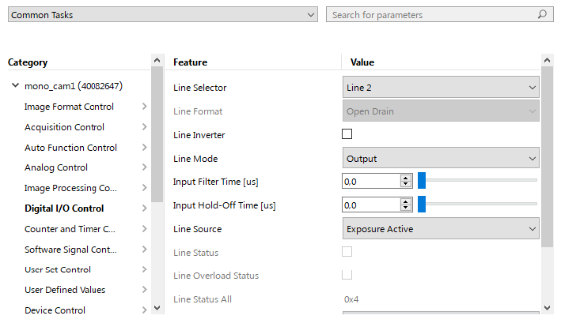

Selective Plane Illumination Microscopy Setup
==================================

_Fluorescence Imaging Laboratory, Kyiv, Ukraine_

</a>

__L-SPIM v0__

# L-SPIM v0 parameters overview

| Parameter                                      | Value                                                        |
| ---------------------------------------------- | ------------------------------------------------------------ |
| Detection objective                            | Olympus PlaN 10x 0.25                                        |
| Magnification                                  | 5.56x                                                        |
| Camera                                         | Basler Ace 2R Pro (a2A5320-23umPRO), 5320x3032 px (16.1 Mpx) |
| Pixel size                                     | 0.493 μm/px                                                  |
| Field of view                                  | 2.62x1.49 mm                                                 |
| Z-stack step resolution                        | 16 μstep/μm (0.0625 μm/μstep)                                |
| Lateral resolution, FWHM theoretical/estimated | 1.12 μm/2.06 μm                                              |
| Axial resolution, FWHM theoretical/estimated   | 11.70 μm/ 6.32 μm                                            |
| Excitation lasers                              | 510 nm, 640 nm                                               |
| Emission filters                               | Chroma HQ545/40m, Chroma D620/20m, Chroma HQ700/75m          |

# Detection arm

## Detection params
| Parameter                                              | Value                               |
| ------------------------------------------------------ | ----------------------------------- |
| Detection objective                                    | Olympus PlaN 10x 0.25 FN 22 (F18)   |
| Detection tube lens                                    | F100                                |
| Magnification                                          | ~5.56x                              |
| Camera                                                 | Basler Ace 2R Pro (a2A5320-23umPRO) |
| Pixel size                                             | 0.493 μm/px                         |
| Field of view                                          | 2.62x1.49 mm                        |
| Theoretical resolution (500 nm)                        | 1.220 μm                            |
| Theoretical depth of field (500 nm, n=1.33)            | 10.640 μm                           |
| Z-stack step (Sutter Instruments MPC-200 with MP225/M) | 0.0625 μm/μstep (16 μstep/μm)       |

## Filters

# Excitation arm
## Light path

## Lasers

# Control software
## Micromanager configuration

## Camera
| Model           | Basler Ace 2R        |
| --------------- | -------------------- |
| ID              | a2A5320-23umPRO      |
| Sensor          | Sony IMX542 (CMOS)   |
| Sensor size     | 14.58x8.31 mm (1.1") |
| Sensor diagonal | 16.78 mm             |
| Pixels (HxV)    | 5320x3032 (16.1 Mpx) |
| Pixel size      | 2.74x2.74 μm         |
| Frame rate      | up to 24 fps         |

### GPIO pinout

|Pin|Function|I/O Line|Colour|
|-|-|-|-|
|1|12–24 VDC camera power|-|Brown|
|2|Opto-coupled I/O input line|Line 1|White|
|3|Ground for opto-coupled I/O line|-|Blue|
|4|General purpose I/O (GPIO) line|__Line 2__|Black|
|5|General purpose I/O (GPIO) line|Line 3|Grey|
|6|Ground for camera power and General Purpose I/O (GPIO) lines|-|Pink|

[Basler Power-I/O Cable](https://docs.baslerweb.com/basler-power-io-cable-m8-6p-open-p)

### GPIO configuration
Pylon Viewer v7.2 camera parameters, category __Digital I/O Control__:

- __Line Selector:__ Line 2
- __Line Inverter:__ not selected
- __Line Mode:__ Output
- __Line Source:__ Exposure Active

</a>

## Sync

Synchronisation with [Arduino32bitBoards](https://micro-manager.org/Arduino32bitBoards), specs for ESP32:

- Baudrate: 115200
- Laser TTL trigger module requires 5V, need level conversion 3.3V -> 5V

__Pinout:__
- Trigger: __Pin 5 - camera Line 2 input__
- Channel 1 (index 0): __Pin 25/DAC - Level Converter ON__
- Channel 2 (index 1): __Pin 26/DAC - 510 nm trigger__
- Channel 3 (index 2): __Pin 27/PWM - 640 nm trigger__
- Channel 4 (index 3): Pin 15/PWM
- Channel 5 (index 4): Pin 14/PWM
- Channel 6 (index 5): Pin 4/PWM
- Channel 7 (index 6): Pin 23/PWM
- Channel 8 (index 7): Pin 19/PWM

__Decimal switch state value for ON is 2^index.__

__Switch states__
|State|Pin Hight|State|
|-|-|-|
|Level Converter ON|25|1|
|510 nm|25+26 (Ch.1+Ch.2)|1+2=__3__|
|640 nm|25+27 (Ch.1+Ch.3)|1+4=__5__|
|510 nm + 640 nm|25+26+27 (Ch.1+Ch.2+Ch.3)|1+2+4=__7__|

## Hardware config

# License 
This open-source project is released under the CERN Open Hardware License. Our aims are to promote open scientific hardware development and to share our engineering solutions.