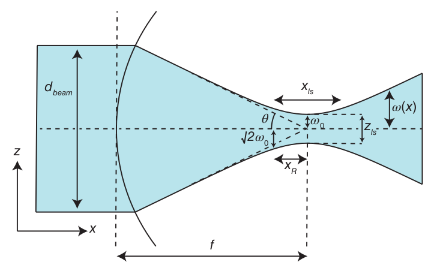
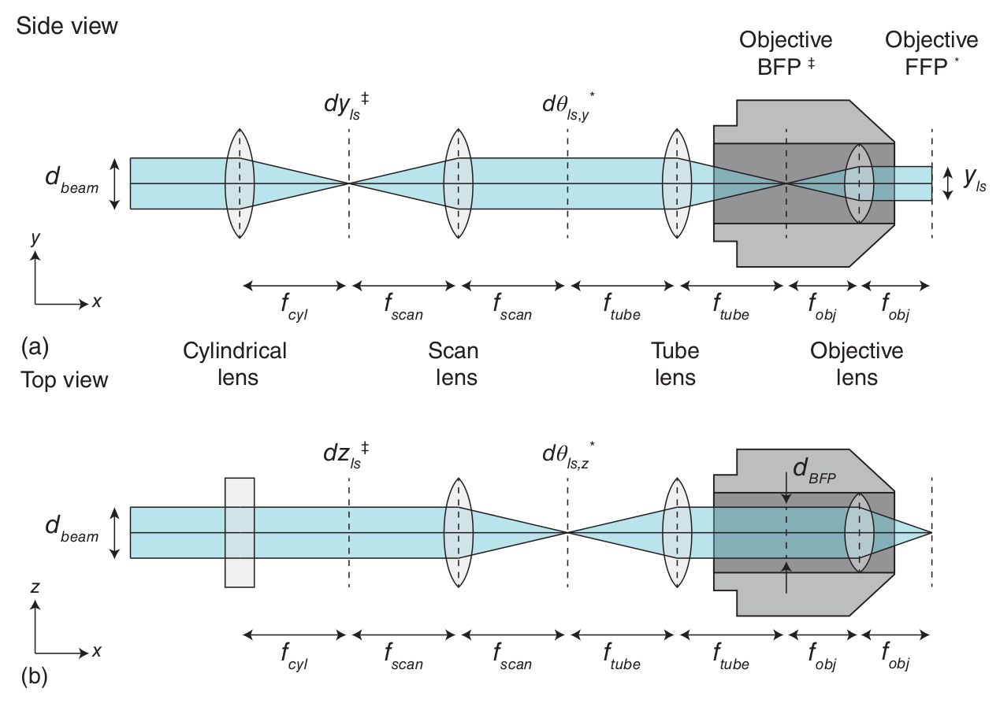

# Design notes

> [!TIP]
> Read more about the SPIM principles: 
>
> - [Selective Plane Illumination Microscopy](https://link.springer.com/chapter/10.1007/978-0-387-45524-2_37)
> - [openSPIM project](https://openspim.org/)
> - [Selective plane illumination microscopy techniques in developmental biology](https://journals.biologists.com/dev/article/136/12/1963/65234/Selective-plane-illumination-microscopy-techniques)
> - [Using tissue clearing and light sheet fluorescence microscopy for the three-dimensional analysis of sensory and sympathetic nerve endings that innervate bone and dental tissue of mice](https://onlinelibrary.wiley.com/doi/full/10.1002/cne.25582)
> [Olarte et al., 2018](https://opg.optica.org/aop/fulltext.cfm?uri=aop-10-1-111&id=381035)
> [Power and  Huisken, 2017](https://whttps://opg.optica.org/aop/fulltext.cfm?uri=aop-10-1-111&id=381035ww.nature.com/articles/nmeth.4224)

## Gaussian litgh sheet

### Gaussian beam
__Focusing of a Gaussian beam__ (_Power and  Huisken, 2022_)
<p align="center">
</a>
</p>


In paraxial approximation:

```math
\sin \theta \approx \tan \theta \approx \theta
```

Accordng this approximation numerical aperture is equal:
```math
NA = n \sin \theta \approx n \theta 
```

Or for air:
```math
NA = \theta \simeq \frac{d_{beam}}{2 f}
```

The Rayleigh range of the beam and beam waist:

```math
\omega (x_R) = \sqrt{2} \omega_0
```

```math
x_R = \frac{\pi \omega_{0}^{2}}{\lambda}
```

Static light sheet thickness:

```math
\theta = \frac{\pi \omega_{0}}{\lambda} \Rightarrow  \omega_0 = \frac{2 f \lambda}{\pi d_{beam}} \Rightarrow z_{ls} = 2 \omega_0 = \frac{4 f \lambda}{\pi d_{beam}}
```

Static light sheet length:

```math
x_R = \frac{\pi \omega_{0}^{2}}{\lambda} \Rightarrow x_R = \frac{4 f^2 \lambda}{\pi d_{beam}^2} \Rightarrow x_{ls} = 2 x_{R} = \frac{8 f^2 \lambda}{\pi d_{beam}^2}
```

### Illumination system
__Relayed generation of a well-corrected static light sheet__ (_Huisken et al., 2004_)
<p align="center">
</a>
</p>


Objective focal length ($f_{ref}$ for Olympus 180 mm):

```math
f_{front} = n_{imm} f_{back}
```

```math
f_{obj} = f_{back} = \frac{f_{ref}}{M}
```

```math
d_{BFP} = d_{beam} \frac{f_{tube}}{f_{scan}}
```

Illumination NA:

```math
NA_{ill} = n_{imm} \theta = \frac{d_{beam} n_{imm}}{2 f_{front}} = \frac{d_{beam}}{2 f_{obj}}
```

Static light sheet parameters:

```math
z_{ls} = \frac{2 \lambda}{\pi NA_{ill}}
```

```math
x_{ls} = \frac{2 n_{imm} \lambda}{\pi NA_{ill}^2}
```

Relay system:

```math
\textbf{Z}_{ls} = z_{ls} \frac{f_{scan}}{f_{tube}} =  \frac{4 f_obj \lambda}{\pi d_{beam}} \cdot \frac{f_{scan}}{f_{tube}}
```

```math
\textbf{X}_{ls} = x_{ls} (\frac{f_{scan}}{f_{tube}})^2 = \frac{8 f_{obj}^2 n_{imm} \lambda}{\pi d_{beam}^2} \cdot (\frac{f_{scan}}{f_{tube}})^2
```

```math
\textbf{Y}_{ls} = \frac{f_{scan}}{f_{cyl}} \frac{f_{obj}}{f_{tube}} d_{beam}
```

## Detection arm
Lateral resolution (Rayleigh criterion):

```math
d_{xy} = \frac{0.61 \cdot \lambda_{det.}}{NA_{det.}}
```

Axial resolution (depth of field/DOF):

```math
d_z = \frac{n \cdot \lambda_{det.}}{NA_{det.}^2}
```

# Samples and desired characteristics

__NB: is 10x NA 0.25 FN 22 enough?__

## Sciatic nerve
- Nerve diameter: 1.5-2 mm
- Nerve length: 5-20 mm
- A-fiber diameter: 1.5 - 10 um 
- C-fiber diameter: 0.5 - 2 um
- Minimal vessel diameter

## Scaffolds
_In progress_

## Characteristics
- FOV ~ 1x2 mm
- Lateral resolution <1.5 um