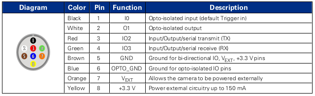

# Hardware notes
- ESP32 with [Arduino32bitBoards device adapter](https://github.com/bonnom/Arduino32BitBoards/tree/master?tab=readme-ov-file)
- OXLaser 510 nm 50 mW, and 620 nm 100 mW
- Basler Ace 2R Pro / Pointgrey Grasshopper 3

## Illumination light path parameters

## Detection objectives

| Model                           | Olympus PlaN | Olympus UPlanFl Ph. 1 |
| ------------------------------- | ------------ | --------------------- |
| Magnification (M)               | 10x          | 10x                   |
| Numerical aperture (NA)         | 0.25         | 0.3                   |
| Working distance (WD)           | 10.6 mm      | 10 mm                 |
| Focal distance (F)              | 18 mm        | 18 mm                 |
| Back focal plane distance (BFP) | N/A          | -19.1 mm              |
| Field number (FN)               | 22           | 26.5 mm               |
| Lateral resolution              | 1.34 μm      | 1.12 μm               |
| Parafocal distance (PD)         | 45 mm        | 65 mm                 |
| Exit pupil diameter (EP)        | 9 mm         | 10.8 mm               |

## Cameras

| Model           | FLIR Grasshopper 3     | Basler Ace 2R        |
| --------------- | ---------------------- | -------------------- |
| ID              | GS3-U3-23S6M-C         | a2A5320-23umPRO      |
| Sensor          | Sony IMX174 (CMOS)     | Sony IMX542 (CMOS)   |
| Sensor size     | 11.25x7.03 mm (1/1.2") | 14.58x8.31 mm (1.1") |
| Sensor diagonal | 13.4 mm                | 16.78 mm             |
| Pixels (HxV)    | 1920x1200 (2.3 Mpx)    | 5320x3032 (16.1 Mpx) |
| Pixel size      | 5.86x5.85 μm           | 2.74x2.74 μm         |
| Frame rate      | up to 162 fps          | up to 24 fps         |

__FLIR Grasshopper 3 GPIO pinout__

</a>

__Basler Ace 2R  GPIO pinout__

</a>

# Software
All control is provided with [Micro-Manager](https://micro-manager.org/) and [pymmcore-plus](https://pymmcore-plus.github.io/pymmcore-plus/) library with [napari-micromanager](https://pymmcore-plus.github.io/napari-micromanager/) GUI.

__Configuration__
| Component | Desctiption                | Micro-manager adapter                                        | Port (laptop)  | Note                                 |
| --------- | -------------------------- | ------------------------------------------------------------ | -------------- | ------------------------------------ |
| Camera    | FLIR Grasshopper3 USB3     | [Point Grey Research](https://micro-manager.org/Point_Grey_Research) | USB 3.0 (COM7) |                                      |
| Stage     | Sutter Instruments MPC-200 | [CustomArduino](https://micro-manager.org/CustomArduino) (MarzhauserLStep Z-stage) |                |                                      |
| Lasers    | Laser control wtih TTL     | [Arduino](https://micro-manager.org/Arduino)                 | COM6           | Change ArduMM version in sketch to 2 |